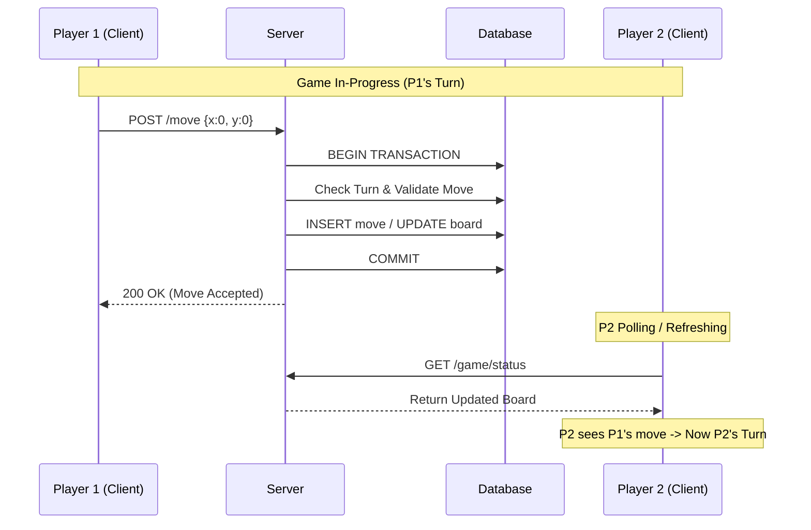

# Fullstack Developer Internship Challenge

**Project:** Turn-Based Tic-Tac-Toe

## Objective

สร้าง Web Application เกม Tic-Tac-Toe แบบ Multiplayer โดยเน้นทดสอบทักษะ System Design, Database Integrity, Concurrency Handling และ Deployment เป้าหมายไม่ใช่แค่การสร้างเกมที่ **เล่นได้** แต่ต้องเป็นระบบที่ **เสถียรและเชื่อถือได้**

## Tech Stack (Recommend)

คุณสามารถเลือกใช้เครื่องมือที่ถนัดได้ แต่ขอแนะนำ Stack ดังนี้:

- **Frontend:** React, Next.js, Vue, หรือ Modern Framework อื่น ๆ
  
- **Backend:** Node.js, Go, Python, หรือ Rust (REST API หรือ GraphQL)
  
- **Database:** Relational Database เช่น PostgreSQL, MySQL
  
- **Infrastructure:** Docker & Docker Compose
  

---

## Timeframe & Expectations

- **ระยะเวลา:** 5 วัน
  
- **คำแนะนำ:** เราให้ความสำคัญกับ **"Quality over Quantity"**
  
  - หากคุณทำไม่ทันทุกฟีเจอร์ภายในเวลาที่กำหนด **ไม่ต้องกังวล** ให้ส่งสิ่งที่คุณทำเสร็จแล้วมา พร้อมเขียนอธิบายใน README ว่าส่วนไหนยังไม่เสร็จและเพราะอะไร
    
  - เราอยากเห็นวิธีคิดและการแก้ปัญหา มากกว่างานที่เสร็จสมบูรณ์แต่โค้ดไม่มีคุณภาพ
    
  - เราไม่ปิดกั้นการใช้ AI-Assisted แต่ **ไม่แนะนำให้ใช้เขียนโค้ดทั้งหมด** หากคุณเลือกที่จะใช้ คุณต้องมั่นใจว่าคุณ **เข้าใจโค้ดทุกบรรทัด** ที่ AI สร้างขึ้น และสามารถอธิบาย Logic การทำงานได้
    

---

## Functional Requirements

### 1. Authentication System

- ผู้ใช้งานต้องสามารถ Register และ Login ได้ (Username/Password)
  
- ใช้มาตรฐานความปลอดภัยพื้นฐาน (เช่น Hash Password, JWT หรือ Session Management)
  

### 2. Game Lobby & Matchmaking

- **Create Room:** ผู้เล่นสามารถสร้างห้องรอเล่นเกมได้
  
- **Join Room:** ผู้เล่นคนที่ 2 สามารถเข้าร่วมห้องได้ผ่าน **Room ID** หรือ **Invite Link**
  
- **Room Capacity (Edge Case Handling):**
  
  - ห้องรองรับผู้เล่นได้ **สูงสุด 2 คน** เท่านั้น (Player 1 และ Player 2)
    
  - หากมีผู้เล่นคนที่ 3 พยายามเข้าร่วมห้องที่เต็มแล้ว ระบบจะต้อง **ปฏิเสธ (Reject)** คำขอ
    
  - *(Optional Bonus)*: อนุญาตให้คนที่ 3 เข้าร่วมในฐานะ **Spectator (ผู้ชม)** เพื่อดูเกมได้ แต่ไม่มีสิทธิ์เดินหมาก
    
- **Status:** ห้องต้องมีสถานะชัดเจน (Waiting, In-progress, Finished)
  

### 3. Gameplay (The Core Challenge)

เกมจะต้องเป็นแบบ **Turn-based (Not Real-time)** โดยมีข้อบังคับทางเทคนิคดังนี้:

- **Communication:** <u>ไม่อนุญาตให้ใช้การสื่อสารแบบ Realtime ทุกประเภท</u> เช่น WebSockets, WebRTC, Server-Sent Events (SSE), Long Polling หรือ Streaming ใด ๆ  
  อนุญาตให้ใช้เฉพาะ **RESTful API ผ่าน HTTP Request แบบ Stateless เท่านั้น**
  
- **Game Flow:**
  
  1. Player ส่งคำขอเดินหมาก (เลือกช่อง)
    
  2. Server ตรวจสอบความถูกต้องของคำขอ
    
  3. Server บันทึกผลลง Database ภายใน Transaction
    
  4. Server ส่ง Response กลับ
    
  5. ฝั่งผู้เล่นอีกคนต้อง Refresh หรือ Poll เพื่อดึงสถานะล่าสุด
    
- **Win/Draw Logic:** ระบบต้องตรวจสอบผู้ชนะหรือเสมอได้ถูกต้อง
  
- Server ต้องเป็น **Single Source of Truth**
  

### 4. Replay Feature (History)

- เมื่อเกมจบลง ผู้เล่นต้องสามารถดูย้อนหลัง (Replay) ได้ว่าแต่ละตาใครเดินที่ช่องไหน ตามลำดับ

---

## Technical Constraints & Challenges (Must Do)

### 1. Race Condition Handling

ระบบต้องสามารถป้องกันกรณีต่อไปนี้:

- ผู้เล่น 2 คนพยายามเดินในช่องเดียวกันพร้อมกัน
  
- ผู้เล่นกดย้ำ ๆ ที่ช่องเดิมหลายครั้ง
  
- ผู้เล่นพยายามเดินในตาที่ไม่ใช่ของตัวเอง
  
- **Requirement:** ระบบต้องรับประกันว่าจะมีเพียง Request เดียวที่สำเร็จ และข้อมูลใน Database ต้องไม่ผิดพลาด (Data Consistency)
  

### 2. Deployment & Environment

- **Docker:** ต้องมีไฟล์ `docker-compose.yml` ที่เมื่อรันคำสั่ง `docker-compose up` แล้ว ระบบทั้งหมด (Frontend, Backend, DB) ต้องพร้อมใช้งานทันทีโดยไม่ต้องตั้งค่าเพิ่ม (สามารถเปลี่ยนเป็น podman, containerd หรือ container-based อื่น ๆ ได้ตามความสะดวก)
  
- **Live Demo:** โปรเจกต์ต้องถูก Deploy ขึ้น Cloud จริง (เช่น Vercel, Railway, Render, Netlify หรือ VPS) และสามารถเข้าเล่นได้ผ่าน URL
  

---

## Bonus Challenges (Optional but Recommended)

หากต้องการคะแนนพิเศษ หรือแสดงศักยภาพเพิ่มเติม:

1. **Bot Mode (The Unbeatable):**
  
  - เพิ่มโหมดเล่นกับ Bot  
  - Bot ต้องทำงานที่ฝั่ง Server-side  
  - Implement Algorithm ที่ทำให้ Bot **ไม่มีวันแพ้** (เสมอหรือชนะเท่านั้น) โดยเปิดกว้างให้ผู้สมัครค้นคว้าและเลือกใช้วิธีการหรือ Algorithm ที่เหมาะสมที่สุดด้วยตนเอง  

2. **Concurrency Test Script:**
  
  - เขียน Script (Unit Test หรือ Integration Test) เพื่อจำลองการยิง Request พร้อมกัน (Race Condition)  
  - พิสูจน์ว่าระบบของคุณสามารถป้องกันปัญหาเช่น การเล่นซ้อนตา, state เพี้ยน หรือ bot ทำงานซ้ำได้จริง  

3. **UI / UX Enhancement:**
  
  - ออกแบบ UI ให้สวยงาม ทันสมัย
  - Responsive รองรับการใช้งานทุกอุปกรณ์ (Mobile / Tablet / Desktop)  
  - UX ต้องเข้าใจง่าย ไม่ซับซ้อน  
  - แสดงสถานะเกมอย่างชัดเจน (ตาใครเล่น, ชนะ/แพ้/เสมอ)  
  - มี feedback ต่อการกระทำของผู้เล่น เช่น animation, highlight หรือข้อความแจ้งเตือน

---

## Submission Guidelines

กรุณาส่งผลงานผ่านช่องทางที่กำหนด โดยต้องประกอบด้วย:

1. **Git Repository URL:** ที่เปิดเป็น Public หรือ Invite: @acuitmeshdev
  
2. **Live Demo URL:** ลิงก์สำหรับเข้าทดลองเล่นจริง
  
3. **README.md:** อธิบายสิ่งต่อไปนี้
  
  - วิธีการ Run โปรเจกต์ (Local Development)
    
  - อธิบาย Architecture ของระบบและการออกแบบ Database (Schema Design)
    
  - **สำคัญ:** อธิบายว่าคุณจัดการปัญหา **Race Condition** อย่างไร? ใช้เทคนิคอะไร?
    
  - รายการฟีเจอร์ที่ทำได้ และฟีเจอร์เสริม (ถ้ามี)
    

---

## Evaluation Rubric

| Category | Weight | Criteria |
| --- | --- | --- |
| Engineering & Concurrency | 40% | - ป้องกัน Race Condition ได้จริง - ใช้ Transaction / Lock อย่างถูกต้อง - ไม่มีโอกาสข้อมูลเสียหาย |
| Correctness & Game Logic | 25% | - Turn-based ทำงานถูกต้อง - Win / Draw Logic ถูกต้องทุกกรณี - Server เป็นผู้ควบคุม Logic ทั้งหมด |
| Code Quality & Structure | 20% | - โค้ดอ่านง่าย แยก Layer ชัดเจน - Naming และ Structure เหมาะสม - Error Handling ดี |
| Completeness & Deployment | 15% | - ทำได้ครบตาม Requirement - Docker ใช้งานได้จริง - Deploy สำเร็จ และเข้าเล่นได้ |

---
